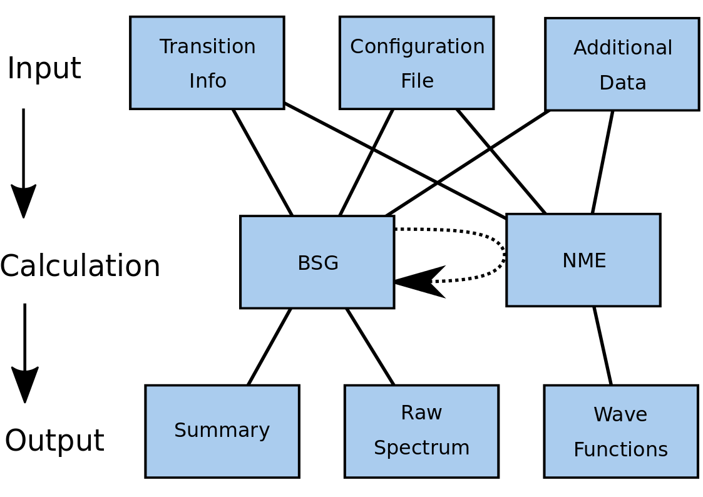
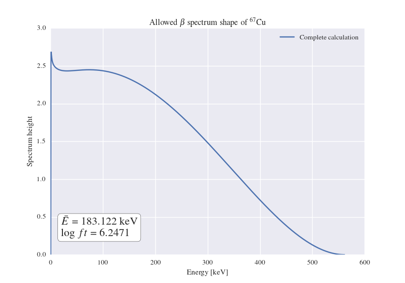
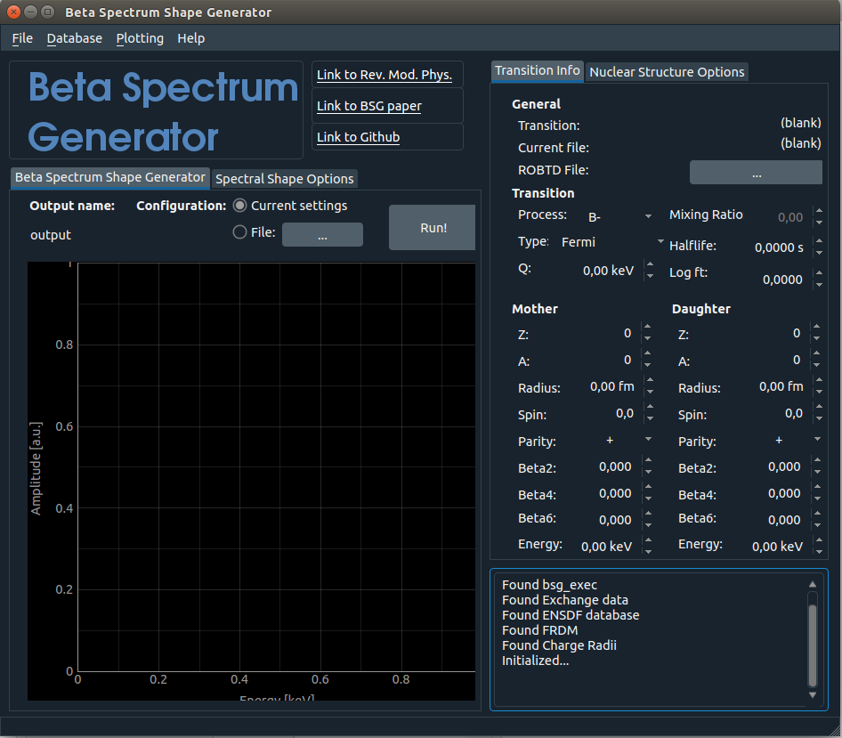
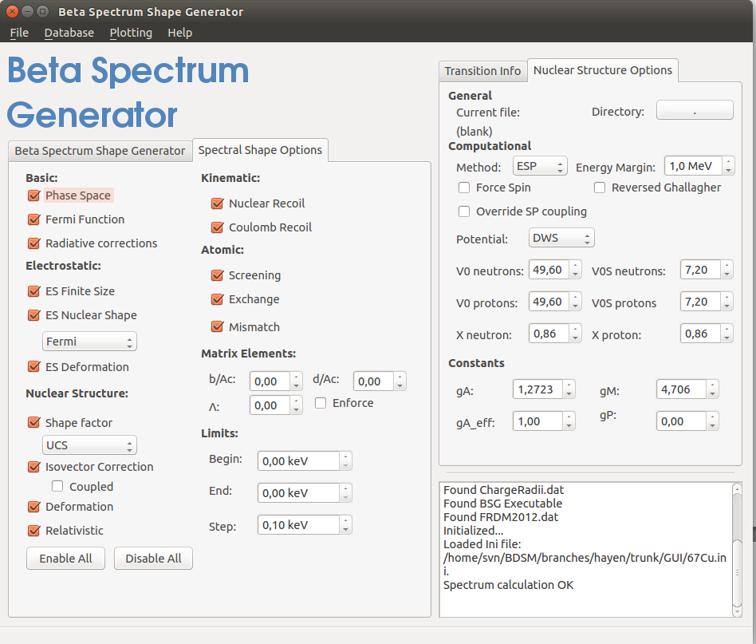

What does it do?
================

The library consists of three parts:

- ``NME``: Calculates Nuclear Matrix Elements in a spherical harmonic oscillator basis.
- ``BSG``: Produces both positron (electron) and (anti)neutrino spectra resulting from allowed nuclear beta decay
- ``BSGUI``: A Qt-based graphical user interface to the ``BSG`` library with connection to databases

Each subsequent item in that list depends on those before it, but not those after it.

The structure can be summarized in the following flowchart

Flowchart describing the general structure of the libraries, their required inputs and outputs. The dotted arrow from ``BSG`` to ``NME`` signifies the possible connection between the two libraries when matrix elements are not provided by the user or proper single-particle wave functions are used in the corrections sensitive to the weak charge distribution.

As an example and for user-friendliness, the package comes with a trivial executable for both C++ libraries.

Example code
------------

Both the ``NME`` and ``BSG`` libraries are trivially implemented into C++ code. The executable delivered with the package for the ``BSG`` library is implemented as

.. code-block:: cpp
  
   #include "Generator.h"
   #include "OptionContainer.h"

   int main(int argc, char** argv) {
     //Singleton class giving access to program input options
     OptionContainer::GetInstance(argc, argv);

     //Macro shorthand for OptionContainer::GetInstance()->OptExists(#a)
     //Input is the only requirement for the program to function
     if (OptExists(input)) {
       //The spectrum generator object
       Generator* gen = new Generator();
       //Output is printed to file
       gen->CalculateSpectrum();
       delete gen;
     }

     return 0;
   }

In its most basic usage, no more steps are needed.

Example output
--------------

After completion of the calculations, three output files are generated. The first of these carries the ``.nme`` extension, and details results of the nuclear wave functions used to calculate the matrix elements. The other two contain the raw spectra (carrying a ``.raw`` extension) and the general results file as ``.txt``. An excerpt of the latter is shown here for the ground state to ground state transition of 67Cu to 67Zn

.. literalinclude:: excerpt_output_67Cu.txt

Plotting the resulting spectrum for two different settings of which corrections to include in the calculation one obtains

GUI Example
-----------

The graphical user interface connects to the ``BSG`` executable, and pulls information from several locally-stored databases. Chiefly among these is the ENSDF_ library, which allows the user to simply select the transition after which all known parameters are already included.

.. _ENSDF: https://www.nndc.bnl.gov/ensdf/

An example of the GUI is use for the 67Cu transition above is shown below

